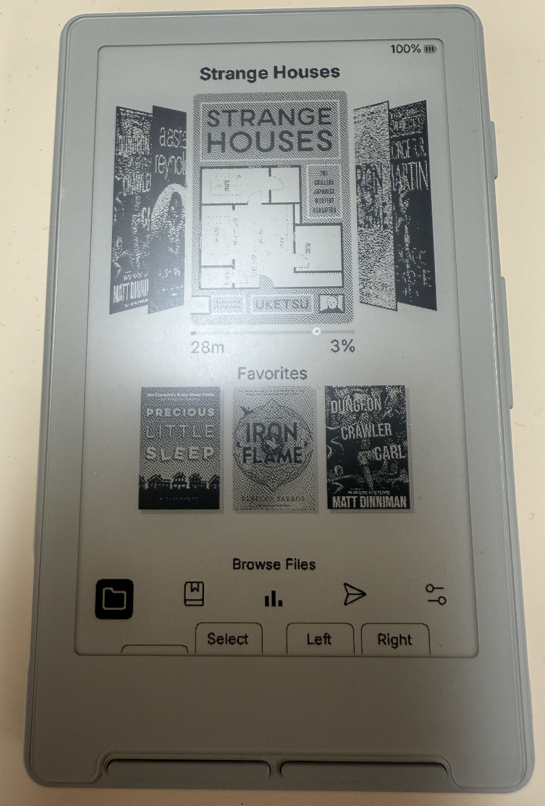
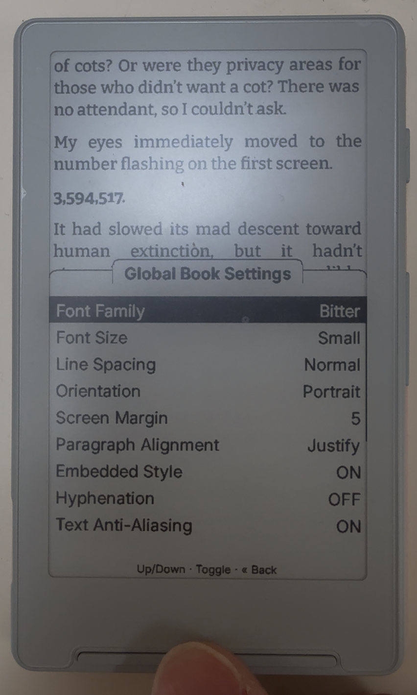

<div align="center">

# CrumBLE

**A personal fork of [CrossInk](https://github.com/uxjulia/CrossInk) for the Xteink X4 / X3 — adds a Bluetooth page-turner, a Collections system + Bookshelf grid, an EPUB optimizer that pre-renders images for Bluetooth reading, an on-demand sleep-screen cycler, and a quick-settings drawer inside books (among other things!).**

</div>

> **Runs on the Xteink X4 (X3 in development) ** — one firmware, auto-detected at boot. **Back up your device before flashing.** See [Install firmware](#install-firmware) below.

---

## What CrumBLE adds

CrumBLE sits on top of CrossInk and CrossInk Carousel's feature set — see the [CrossInk Carousel README](https://github.com/chintanvajariya/CrossInk-Carousel#whats-different-from-crossink) and [CrossInk's docs](https://github.com/uxjulia/CrossInk) for those features. The sections below cover what's distinct to this fork.

As of v3.0.0, CrumBLE is rebased onto **CrossInk 1.3** (a fresh upstream base rather than back-porting), so it also inherits 1.3's additions — SD-card font sizes, Quick Resume, the Minimal sleep screen, low-memory OPDS handling, and more.

### Collections

A full collections system with virtual + user-defined collections, all "swipeable" from the home shelf:

- **Virtual collections** computed lazily: **All Books**, **Favorites**, **Recent**, **Currently Reading**, **Finished**, **Unopened**
- **User collections** you create and rename freely
- **Long-press Confirm** on a book → toggle membership in any collection
- **Long-press shelf header** → New collection, Sort by, Rearrange, Show/Hide virtuals, Rescan library
- **Rearrange flow** lets you set the L/R cycle order by tapping collections in your desired sequence (Confirm reads "Mark 1", "Mark 2", ..., Back reads "Undo" mid-flow). Persisted across reboots.
- **Add/Remove Books** multi-select picker so you can curate a whole collection in one pass
- **Per-collection sort** (A–Z / Z–A / Author A–Z / Author Z–A / Date Added), persisted in `collections.json`
- Optional **series collapse** that folds same-series books into one spine glyph on the shelf; tapping the spine opens a mini-picker of the series members

### Bookshelf grid

Browse the active collection as a 3×3 grid of cover thumbnails instead of cycling through the carousel:

- **Bookshelf** entry on the home icon bar opens the grid over your current collection
- **Short-press** the carousel header (collection title) opens the same grid
- **Long-press** the Bookshelf icon brings up a full-screen picker to switch collections without leaving the grid
- Cover thumbs are pre-cached at exact cell dimensions, so revisits don't flash a "Loading" popup looking for thumbs that already exist
- Failed cover thumbnails are remembered (per book) so a corrupt cover doesn't trigger an infinite retry loop on every render

<p align="center">
  
  
</p>

### Bluetooth remote page-turner

Pairing is done from WITHIN A BOOK ONLY! Click on the "Confirm" button while inside a book to open the reader menu. Navigate to Bluetooth and follow the instructions there to pair a BT HID remote (e.g. an [IINE GameBrick](https://www.amazon.com/dp/B0CK4DNQM4)) and use it as a wireless page-turner. BLE auto-disables when you exit the book to keep heap pressure off the parser, so you will need to reconect again when you enter a new book.

Shout-out to [thedrunkpenguin](https://github.com/thedrunkpenguin/crosspoint-reader-ble/) for his BT changes which I learned much from and added some memory changes to make it all fit.

A **BT Quick Connect** action lives in the [Global Book Settings drawer](#global-book-settings-drawer) for one-step re-connect to your last bonded remote without re-navigating the menu tree. Once linked, the same entry becomes **BT Disconnect**. A persistent "Connecting Bluetooth..." popup spans the NimBLE init and GATT handshake so the page doesn't sit unchanged for several seconds without feedback.

For image-heavy books, two complementary paths keep the link stable:
- **EPUB optimizer Bluetooth pre-rendering** (web optimizer at `/optimizer`) pre-renders each image to a per-device pixel cache (`.pxc`) at your screen's exact viewport, then bakes a small manifest of the settings the bake was made against. Image-heavy chapters then render over Bluetooth without thrashing the link or needing the JPEG/PNG decoder. If your current font/margin/image-rendering/orientation differs from the bake, the reader prompts on Quick Connect: switch back to the baked layout, keep your settings and reflow, or cancel.
- **BT No Images Quick Connect** is a one-tap drawer action for books that weren't pre-rendered. It suppresses image decode at render time (image regions show a thin placeholder border) so the heap stays clear for NimBLE.

<p align="center">
  
</p>

### On-demand sleep-screen cycling

A new display setting — **Tap Power While Asleep to Cycle** — lets you flip through your `/.sleep` images without fully waking the device. A brief power-button tap picks a fresh random image and re-enters deep sleep. Off by default (each cycle costs a boot + e-ink half-refresh worth of battery); pinned sleep images are skipped in cycle mode.

`.png` sleep images (with transparency) are also supported in **Custom** mode now, not just Page Overlay. Transparent regions compose over the clean last reader page, so a translucent PNG sleep screen reveals the book underneath.

<p align="center">
  
</p>

### Global Book Settings drawer

Long-press the menu button inside a book to pop up a bottom-drawer quick-settings panel. Every reader setting — font, size, hyphenation, bionic, line spacing, paragraph alignment, image rendering — is one tap away with e-ink fast refresh so toggles feel snappy. Closing the drawer re-flows the page only if a setting actually changed; a no-op visit skips the re-layout.

Architecture adapted from [inx by Dave Allie](https://github.com/obijuankenobiii/inx) (MIT).

<p align="center">
  
</p>

---

## Other improvements

- **Faster home + book open** — Phase 1 fast book open defers non-critical reader setup (settings cache, .pxc manifest parse, font glyph prewarm) to after the first page actually paints. In-RAM cover bitmap cache wired across the Flow carousel and Bookshelf grid so navigation hits memory instead of re-decoding from SD on every cell.
- **Author shown under carousel books** — the Flow carousel displays the author name under each cover above the progress bar.
- **Reading Stats redesign** — bigger covers, an index-0 cookie-logo summary card, and the multi-book totals when global stats exist.
- **Reading time accuracy** — deep-sleep commit path flushes the active session so power-off never loses minutes. The 10-second minimum-session floor was dropped; very short sessions count too. Idempotent re-commit prevents double-counting. Ported from [aalu's reading-stats fix](https://github.com/aaludon/crosspoint-reader-aalu) (MIT).
- **Persistent cursor recall** — leaving home for Settings / File Browser / Bookshelf and coming back puts the cursor back where you left it on each side (carousel + shelf + menu row), instead of resetting to index 0.
- **Recents auto-heal** — if a foreign firmware writes an incompatible recent.json shape between CrumBLE boots, the first home visit walks per-book stats.bin sidecars and rebuilds the carousel from them (sorted newest first).
- **PNG previews in the file browser** — `.png` files render as a preview over the last book page; you can also set any PNG as a sleep image.
- **Carousel ghosting fixes** on the Lyra Flow theme — max-size cover-slot clear before each paint, thinned selection border, dropped the always-on inner frame so successive scrolls don't leave outline residue, and the side covers no longer clip at the screen edges.
- **PackBits-compressed BW backup** for the grayscale AA pass — a single 16–32 KB bounded buffer replaces the chunked 12 × 4 KB lazy allocation, dropping the fragmentation pressure that made grayscale fail when BLE was active.
- **Auto-retry on chapter-layout abort** — if the parser trips the low-heap floor with BLE consuming its ~58 KB share, CrumBLE silently drops BLE, retries the layout with the recovered headroom, and lets the existing auto-reconnect logic re-pair on your next remote press.
- **Glyph buffer pre-grown at every BT-enable site** so the font scratch's high-water mark is allocated BEFORE NimBLE eats heap, preventing the mid-page-turn allocation failures that used to drop the BT link on text-heavy chapters.
- **Large-library + home stability** (v3.0.x) — streaming library index that survives big libraries, crash-proofed series detection, a Lyra Carousel heap-race crash fix, cover-thumbnail revalidation so a single book can't get stuck on a placeholder, and transparent-PNG sleep screens that reliably show the clean last book page.

For the full changelog, see [CHANGELOG.md](./CHANGELOG.md).

---

## Languages

**UI translations (23 languages)** — the menus, buttons, and prompts are translated. Missing strings fall back to English automatically.

Belarusian, Catalan, Czech, Danish, Dutch, English, Finnish, French, German, Hungarian, Italian, Kazakh, Lithuanian, Polish, Portuguese, Romanian, Russian, Slovenian, Spanish, Swedish, Turkish, Ukrainian, Vietnamese.

**Hyphenation dictionaries (9 languages)** — used by the EPUB renderer to insert soft hyphens at language-correct break points so justified text doesn't leave huge gaps.

English, French, German, Italian, Polish, Russian, Spanish, Swedish, Ukrainian.

**Bundled reader fonts** — Bitter, Charein, Inter, Lexend Deca — each in regular / bold / italic / bold-italic at three sizes (12, 14, 16 pt). For other fonts, drop a `.cpfont` file in `/fonts` on the SD card and it shows up in the reader's font picker.

---

## Lineage

```
CrossPoint Reader  →  CrossInk (uxjulia)  →  CrossInk Carousel (chintanvajariya)  →  CrumBLE
```

- **[CrossPoint Reader](https://github.com/crosspoint-reader/crosspoint-reader)** — the further-upstream foundation. Most reader features (fonts, BookSettings, sleep screens, web UI) come from here.
- **[CrossInk](https://github.com/uxjulia/CrossInk)** — uxjulia's fork. UI polish, localization, additional reader fonts. CrumBLE is rebased onto CrossInk 1.3 as of v3.0.0.
- **[CrossInk Carousel](https://github.com/chintanvajariya/CrossInk-Carousel)** — chintanvajariya's fork. Adds the Flow theme (3D book carousel), 3×3 Recent Books grid, and the multi-book Reading Stats redesign.
- **CrumBLE** — this fork. Adds BLE, Collections, sleep-screen cycling, and the in-book quick-settings drawer.

CrumBLE is named after — and themed around — the chocolate-chip cookie boot logo. The "BLE" remained from the previous fork name (FlexBLE) because that's still the headline feature.

---

## Install firmware

1. Download `crumble-firmware.bin` from the [Releases](https://github.com/imshentastic/CrumBLE/releases) page (includes Bluetooth page-turner support).
2. Connect your Xteink X4 / X3 via USB-C and wake / unlock the device.
3. Go to https://crosspointreader.com/#flash-tools, select your device, choose **Custom .bin**, pick the file you downloaded, and click **Flash**.

To revert to official Xteink firmware, flash the latest stock build from the same page.

---

## USB-locked devices

Some Xteink units sold through third-party stores (e.g. AliExpress) ship with USB flashing locked from the factory. If your device is locked, you'll need the **Xteink Unlocker** at https://crosspointreader.com/#unlock-tool before you can flash CrumBLE.

**You do not need the unlocker if you bought directly from xteink.com** — those units aren't locked.

**Critical warning:** The unlocker officially supports only CrossPoint and CrossInk firmwares. Flashing a non-supported firmware on a USB-locked device can permanently brick it or leave it stuck on that firmware with no recovery path. **CrumBLE does support OTA**, but verify the boot logo appears after first flash before assuming you have an out. If in doubt, flash CrossInk first, confirm OTA works, then OTA-upgrade to CrumBLE.

---

## Build from source

```bash
# Tiny build (BLE-capable, default partition)
pio run -e tiny

# Flash to a connected device
pio run -e tiny -t upload

# Simulator (desktop, for UI iteration)
pio run -e simulator        # X4 panel (800x480)
pio run -e simulator_x3     # X3 panel (792x528)
.pio/build/simulator/program
```

See [docs/contributing/getting-started.md](./docs/contributing/getting-started.md) for the full development setup.

---

## License

Inherits the upstream MIT license. Third-party code attribution lives in [CHANGELOG.md](./CHANGELOG.md) per-feature.
